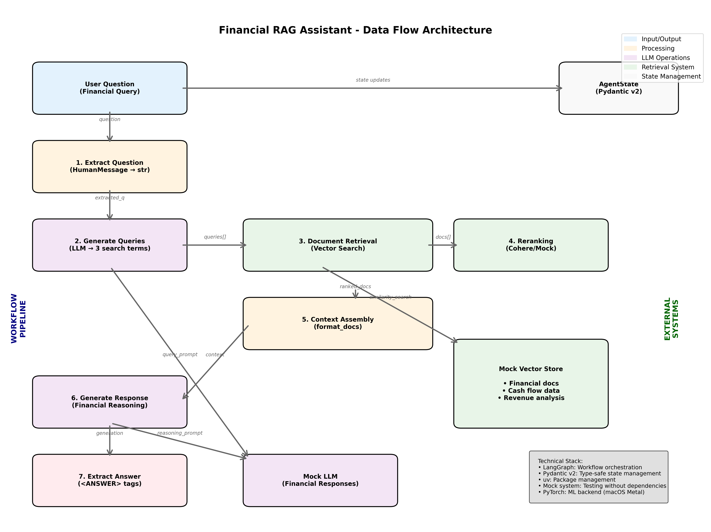
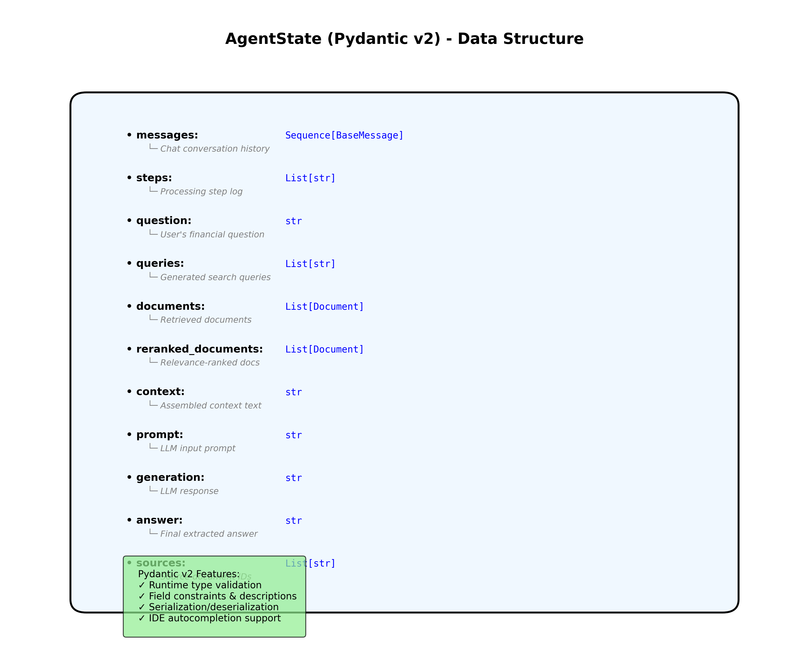

# Financial RAG Assistant

A ConvFinQA RAG (Retrieval-Augmented Generation) pipeline that fine-tunes small instruction-tuned LLMs on structured financial reasoning tasks. Built with modern tooling including uv package management, Pydantic v2 state management, and LangGraph workflow orchestration.

## 🏗️ Architecture Overview



### Core Components

- **LangGraph Workflow**: Multi-node graph orchestrating the complete RAG pipeline
- **Pydantic v2 State**: Type-safe state management with validation and constraints
- **Mock System**: Comprehensive testing without external LLM/vector DB dependencies
- **uv Package Manager**: Modern Python packaging with `pyproject.toml`

### Data Flow

1. **Question Extraction** → Extract user question from input messages
2. **Query Generation** → Generate 3 search queries using LLM
3. **Document Retrieval** → Vector similarity search across financial documents  
4. **Reranking** → Relevance scoring and filtering (optional)
5. **Context Assembly** → Format retrieved documents into structured context
6. **LLM Generation** → Financial reasoning with step-by-step analysis
7. **Answer Extraction** → Parse final answer from LLM response



## 🧠 Objective

Fine-tune small, instruction-tuned LLMs on structured financial reasoning tasks—calculating ratios, extracting numeric facts, and multi-step financial analysis—with step-by-step supervision and retrieval augmentation.

## 📦 Installation

### Modern Setup with uv

```bash
# Install uv package manager
curl -LsSf https://astral.sh/uv/install.sh | sh

# Create environment and install dependencies
uv sync
```

### Legacy Setup

```bash
python3.10 -m venv venv
source venv/bin/activate
pip install -r requirements.txt
```

## 🧪 Testing

### End-to-End Pipeline Test

Test the complete workflow without external dependencies:

```bash
uv run python test_workflow.py
```

This runs a comprehensive test using mock LLM and retrieval systems to validate:
- Individual workflow nodes
- Complete pipeline execution  
- Multiple question types
- Pydantic v2 state management

### Generate Architecture Diagrams

```bash
uv run python data_flow_diagram.py
```

Creates visual diagrams:
- `financial_rag_dataflow.png` - Complete pipeline architecture
- `agent_state_structure.png` - Pydantic v2 state model

---

### 📂 Dataset

The dataset I used is linked here [**Oscar-ConvFinQA**](https://huggingface.co/datasets/michael-sigamani/Oscar-ConvFinQA). 
It is a cleaned and Chain-of-Thought (CoT) augmented version of ConvFinQA-style examples, created using teacher LLMs and schema-based curation.

Each entry in the dataset includes:
```json
{
  "question": "...",
  "context": "...",
  "program": "...",
  "answer": "...",
  "reasoning": "...",
  "table": "..."
}
```

📌 Source: huggingface.co/datasets/michael-sigamani/Oscar-ConvFinQA

---

## 🧪 Evaluation

Evaluation is two-fold:

### 1. Retrieval Accuracy (e.g., Recall@3)

```bash
python eval/eval_retrieval_r@3.py
```

### 2. Full LangGraph Execution Accuracy

```bash
python eval/eval_langgraph.py
```

This runs the model’s predicted program over retrieved tables and compares results against gold answers.

---

## 🧬 Fine-Tuning

Fine-tune with LoRA:

```bash
python scripts/fine_tune.py --config configs/config_finetune.yaml
```

This will:
- Load a quantized model (from Hugging Face or a local GGUF file)
- Apply LoRA adapters
- Train with reasoning supervision
- Save merged model and logs to `checkpoints/`

---

## 🔍 Inference

Run inference locally using a fine-tuned checkpoint:

```bash
python scripts/run_inference.py --input example.json --checkpoint ./checkpoints/oscar-lora
```

---

## ⚙️ Configuration

All training hyperparameters are defined in `configs/config_finetune.yaml`:

```yaml
model_name_or_path: "meta-llama/Llama-2-7b-hf"
output_dir: "./checkpoints/oscar-lora"
dataset_path: "./data/curriculum_generated.jsonl"

num_train_epochs: 3
per_device_train_batch_size: 8
gradient_accumulation_steps: 2
learning_rate: 2e-4
lr_scheduler_type: "cosine"
warmup_ratio: 0.1
lora_rank: 8
lora_alpha: 16
lora_dropout: 0.05
```

---

## 📚 Citation & Credits

- Built using Hugging Face Transformers, PEFT, and LangGraph.
- Dataset adapted from ConvFinQA by TheFinAI + curriculum-generated CoT data.

---
## 🛠️ Maintainer

Michael Sigamani  
[github.com/sigamani](https://github.com/sigamani)  
Licensed under Apache 2.0
